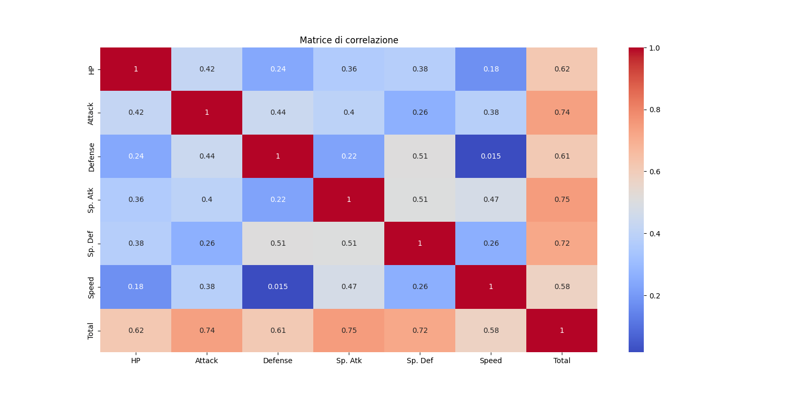
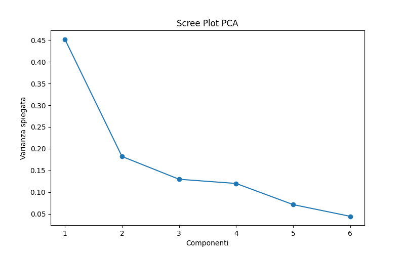
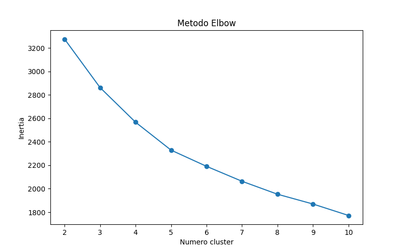
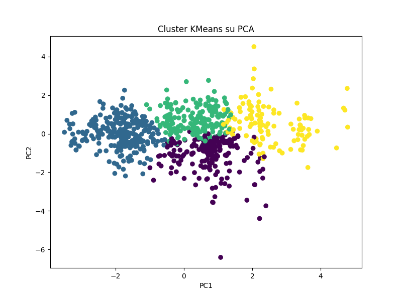

# Pokémon Data Science Project

[](https://www.python.org/)
[](https://pandas.pydata.org/)
[](https://numpy.org/)
[](https://matplotlib.org/)
[](https://seaborn.pydata.org/)
[](https://scikit-learn.org/)

---

## Descrizione del progetto

Questo progetto studia un dataset contenente le statistiche di 800 Pokémon per individuare gruppi naturali di elementi simili tra loro. L’obiettivo è capire se, osservando solo le caratteristiche numeriche dei Pokémon, emergono pattern utili per distinguere profili differenti come Pokémon difensivi, veloci, bilanciati o particolarmente forti.

Il lavoro è stato sviluppato con un approccio progressivo:

1. analisi iniziale del dataset,
2. pulizia e controllo dei dati,
3. analisi esplorativa,
4. standardizzazione,
5. PCA,
6. clustering con K-Means,
7. confronto con clustering gerarchico,
8. interpretazione finale dei gruppi ottenuti.

---

## Obiettivi

* Comprendere la struttura del dataset.
* Verificare la presenza di valori mancanti e duplicati.
* Studiare le distribuzioni delle statistiche dei Pokémon.
* Analizzare le relazioni tra le variabili numeriche.
* Ridurre la dimensionalità dei dati con PCA.
* Raggruppare i Pokémon in cluster simili con K-Means.
* Valutare la qualità dei cluster con Silhouette Score.
* Interpretare i cluster in relazione alla variabile `Legendary`.

---

## Dataset utilizzato

Il file `Pokemon.csv` contiene le seguenti variabili:

* `#`: numero identificativo nel Pokédex
* `Name`: nome del Pokémon
* `Type 1`: tipo principale
* `Type 2`: tipo secondario, non sempre presente
* `Total`: somma complessiva delle statistiche base
* `HP`: punti salute
* `Attack`: attacco fisico
* `Defense`: difesa fisica
* `Sp. Atk`: attacco speciale
* `Sp. Def`: difesa speciale
* `Speed`: velocità
* `Generation`: generazione di appartenenza
* `Legendary`: indicazione se il Pokémon è leggendario

---

## Librerie utilizzate

```python
import pandas as pd
import numpy as np

import matplotlib.pyplot as plt
import seaborn as sns

from sklearn.preprocessing import StandardScaler
from sklearn.decomposition import PCA
from sklearn.cluster import KMeans, AgglomerativeClustering
from sklearn.metrics import silhouette_score

```

### Perché queste librerie

* `pandas`: per la gestione e l’analisi dei dati tabellari.
* `numpy`: per il calcolo numerico e le operazioni matematiche.
* `matplotlib`: per la creazione dei grafici.
* `seaborn`: per la visualizzazione statistica, in particolare la heatmap della correlazione.
* `StandardScaler`: per standardizzare le variabili numeriche.
* `PCA`: per ridurre la dimensionalità mantenendo più informazione possibile.
* `KMeans`: per il clustering non supervisionato.
* `AgglomerativeClustering`: per un confronto con un secondo algoritmo di clustering.
* `silhouette_score`: per valutare la qualità dei cluster.

---

## Workflow del progetto

---

### 1. Caricamento del dataset

```python
import pandas as pd

df = pd.read_csv("Pokemon.csv")
print(df.shape)
print(df.head())
print(df.info())

```

### Spiegazione

In questa fase il dataset viene caricato in un DataFrame di pandas. Le funzioni usate servono a:

* `shape`: controllare quante righe e colonne sono presenti;
* `head()`: visualizzare le prime righe;
* `info()`: verificare tipi di dato e presenza di valori nulli.

Questa fase è importante perché permette di capire subito com’è strutturato il dataset e se ci sono problemi iniziali nei dati.

---

### 2. Controllo dei valori mancanti

```python
print(df.isnull().sum())

```

### Spiegazione

Questa istruzione conta i valori mancanti per ogni colonna. Nel dataset Pokémon, la colonna `Type 2` presenta valori nulli perché non tutti i Pokémon hanno un secondo tipo.

Il controllo dei missing values è fondamentale per decidere se imputare, rimuovere o lasciare tali valori, a seconda del tipo di analisi.

---

### 3. Verifica dei duplicati

```python
print(df.duplicated().sum())

```

### Spiegazione

Questa operazione controlla se ci sono righe duplicate nel dataset. La presenza di duplicati può alterare le analisi statistiche e i risultati del clustering.

Nel progetto non sono stati trovati duplicati.

---

### 4. Statistiche descrittive

```python
df.describe()

```

### Spiegazione

Le statistiche descrittive riassumono il comportamento delle variabili numeriche attraverso indicatori come:

* media,
* deviazione standard,
* minimo,
* massimo,
* quartili.

Questa fase serve a capire il range delle statistiche dei Pokémon e a individuare eventuali valori estremi.

---

### 5. Analisi della distribuzione delle variabili numeriche

```python
stats = ['HP', 'Attack', 'Defense', 'Sp. Atk', 'Sp. Def', 'Speed']

df[stats].hist(figsize=(12, 8), bins=20)
plt.suptitle("Distribuzione statistiche Pokemon")
plt.tight_layout()
plt.show()

```

### Spiegazione

Gli istogrammi permettono di osservare come si distribuiscono le statistiche dei Pokémon.

Questa analisi consente di capire:

* se le variabili sono concentrate attorno a certi valori,
* se esistono code lunghe o valori estremi,
* se alcune statistiche hanno un comportamento simile tra loro.

È una parte importante dell’EDA perché fornisce una prima intuizione sulla forma dei dati.

---

### 6. Analisi della correlazione

```python
corr = df[stats + ['Total']].corr()

sns.heatmap(corr, annot=True, cmap='coolwarm')
plt.title("Matrice di correlazione")
plt.show()

```

#### Grafico Output


### Spiegazione e Lettura del Grafico

La matrice di correlazione mostra il grado di relazione lineare tra le variabili numeriche. I valori si muovono in un intervallo compreso tra 0 (nessuna relazione) e 1 (perfetta relazione positiva), passando dalle tonalità fredde del blu alle tonalità calde del rosso.

Dall'osservazione diretta del grafico emergono dei pattern ricorrenti nel game design dei Pokémon:

* **La Diagonale Rossa (Valori uguali a 1):** Rappresenta l'incrocio strutturale di ogni variabile con se stessa (es. HP con HP). Può essere ignorata nell'analisi biologica dei dati.
* **Il blocco dei "Tank" (Defense & Sp. Def = 0.51):** È il valore più alto registrato tra le statistiche base. Indica che i Pokémon progettati con una forte difesa fisica tendono ad avere, di riflesso, anche un'ottima difesa speciale. Le due statistiche crescono spesso insieme per bilanciare i mostriciattoli difensivi.
* **Il blocco dei "Maghi" (Sp. Atk & Sp. Def = 0.51):** Mostra un legame moderatamente forte. Molti Pokémon orientati all'attacco speciale (come i tipi Psico, Spettro o Erba) compensano la frequente fragilità fisica con una difesa speciale naturale molto solida.
* **Il blocco offensivo (Attack & Defense = 0.44 e Attack & Sp. Atk = 0.40):** Conferma la tendenza generale a potenziare contemporaneamente i comparti d'attacco o la combinazione attacco/difesa fisica.
* **L'indipendenza della Velocità (Speed & Defense = 0.015):** Questo quadratino blu scuro evidenzia una correlazione praticamente nulla. Significa che l'agilità di un Pokémon non è minimamente legata alla sua corazza fisica: esistono tank statici e lentissimi così come tank estremamente rapidi.
* **La riga "Total" (Valori da 0.58 a 0.75):** Mostra una correlazione arancione diffusa e costante con tutte le colonne. Questo legame è matematicamente ovvio poiché la variabile `Total` non è altro che la somma algebrica delle sei statistiche sottostanti.

### Perché questa analisi motiva l'uso della PCA?

La heatmap rivela che le variabili sono parzialmente ridondanti (alcune si muovono insieme seguendo logiche precise). La PCA è lo strumento perfetto per questo scenario: permette di comprimere queste 6 dimensioni originarie in un numero minore di assi cartesiani latenti senza perdere troppa informazione.
*Nota per il codice:* Essendo il `Total` una combinazione lineare esatta delle altre variabili, **dovrà essere rimosso prima di calcolare la PCA** per evitare problemi di multicollinearità e calcoli distorti sulla varianza.

---

### 7. Analisi dei tipi di Pokémon

```python
df["Type 1"].value_counts().plot(kind="bar")
plt.title("Distribuzione Type 1")
plt.show()

```

### Spiegazione

Questo grafico mostra quanti Pokémon appartengono a ciascun tipo principale.

Serve a fornire un contesto descrittivo sul dataset e a osservare se alcuni tipi sono più rappresentati di altri.

---

### 8. Selezione delle variabili per il clustering

```python
X = df[['HP', 'Attack', 'Defense', 'Sp. Atk', 'Sp. Def', 'Speed']]

```

### Spiegazione

Per il clustering vengono usate solo le variabili numeriche relative alle statistiche di combattimento.

Sono state escluse le colonne testuali e identificative come `Name`, `Type 1`, `Type 2`, `#` e `Legendary` perché l’obiettivo del clustering è far emergere gruppi basati esclusivamente sulle caratteristiche statistiche, senza usare etichette già note.

---

### 9. Standardizzazione dei dati

```python
from sklearn.preprocessing import StandardScaler

scaler = StandardScaler()
X_scaled = scaler.fit_transform(X)

```

### Spiegazione

Le variabili originali hanno scale diverse. Ad esempio, HP e Speed non hanno gli stessi intervalli di valori. Se non si standardizzano i dati, le variabili con valori più grandi potrebbero influenzare troppo il modello.

La standardizzazione trasforma ogni variabile in una distribuzione con media 0 e deviazione standard 1.

#### Formula

```text
z = (x - μ) / σ

```

Dove:

* `x` è il valore originale,
* `μ` è la media della variabile,
* `σ` è la deviazione standard.

Questa trasformazione rende le variabili confrontabili tra loro.

---

### 10. PCA (Principal Component Analysis)

```python
from sklearn.decomposition import PCA

pca = PCA()
X_pca = pca.fit_transform(X_scaled)

```

### Spiegazione

La PCA è una tecnica di riduzione dimensionale che trasforma le variabili originali in nuove componenti chiamate componenti principali.

L’idea è costruire nuove direzioni nello spazio dei dati che conservino quanta più informazione possibile, cioè quanta più varianza possibile.

In pratica, la PCA permette di riassumere le 6 statistiche dei Pokémon in un numero minore di variabili, semplificando la lettura dei dati.

#### Formula concettuale

```text
PC1 = a1·HP + a2·Attack + a3·Defense + a4·Sp. Atk + a5·Sp. Def + a6·Speed

```

I coefficienti `a1, a2, ...` vengono scelti automaticamente dall’algoritmo per massimizzare la varianza catturata dalla componente.

---

### 11. Varianza spiegata

```python
explained_variance = pca.explained_variance_ratio_
print(explained_variance)
print(np.cumsum(explained_variance))

```

### Spiegazione

La varianza spiegata indica quanta informazione viene conservata da ciascuna componente principale.

Nel progetto, le prime componenti spiegano una grande parte della varianza totale, il che significa che buona parte dell’informazione presente nelle sei statistiche può essere riassunta in poche dimensioni.

Questo risultato giustifica l’uso della PCA for la visualizzazione e l’analisi dei dati.

---

### 12. Scree Plot

```python
plt.plot(range(1, len(explained_variance) + 1), explained_variance, marker='o')
plt.xlabel("Componenti")
plt.ylabel("Varianza spiegata")
plt.title("Scree Plot PCA")
plt.show()

```

#### Grafico Output


### Spiegazione

Lo scree plot mostra visivamente quanta varianza è spiegata da ciascuna componente.

Serve per capire quante componenti sono davvero utili e dove la curva inizia a stabilizzarsi.

---

### 13. Proiezione PCA in 2D

```python
pca2 = PCA(n_components=2)
X_2d = pca2.fit_transform(X_scaled)

plt.scatter(X_2d[:, 0], X_2d[:, 1], alpha=0.6)
plt.xlabel("PC1")
plt.ylabel("PC2")
plt.title("Proiezione PCA")
plt.show()

```

### Spiegazione

Ridurre i dati a due componenti permette di visualizzare i Pokémon in un piano bidimensionale.

Ogni punto rappresenta un Pokémon:

* punti vicini = Pokémon con statistiche simili,
* punti lontani = Pokémon con statistiche diverse.

Questa visualizzazione è molto utile per osservare la struttura generale del dataset prima del clustering.

---

### 14. Metodo Elbow per K-Means

```python
inertia = []
K = range(2, 11)

for k in K:
    model = KMeans(n_clusters=k, random_state=42, n_init=10)
    model.fit(X_scaled)
    inertia.append(model.inertia_)

```

#### Grafico Output


### Spiegazione

Il metodo Elbow serve a scegliere il numero di cluster più adatto.

L’`inertia` misura quanto i punti sono vicini ai centri dei cluster. Più è bassa, più i cluster sono compatti.

Si cerca il punto in cui la diminuzione dell’inertia rallenta sensibilmente: quel punto indica un buon compromesso tra semplicità e qualità della segmentazione.

---

### 15. Silhouette Score

```python
for k in range(2, 11):
    km = KMeans(n_clusters=k, random_state=42, n_init=10)
    labels = km.fit_predict(X_scaled)
    score = silhouette_score(X_scaled, labels)
    print(f"k={k} --> {score:.3f}")

```

### Spiegazione

Il Silhouette Score misura quanto bene i cluster sono separati tra loro.

Un valore più alto indica cluster più compatti e meglio distinti. Nel progetto, il valore migliore è stato ottenuto con `k=2`, ma è stato scelto `k=4` per una lettura più interpretabile dei gruppi e una segmentazione più ricca dal punto di vista esplorativo.

#### Formula intuitiva

```text
s = (b - a) / max(a, b)

```

Dove:

* `a` è la distanza media dei punti dal proprio cluster,
* `b` è la distanza media dal cluster più vicino.

---

### 16. Clustering finale con K-Means

```python
kmeans = KMeans(n_clusters=4, random_state=42, n_init=10)
df["Cluster"] = kmeans.fit_predict(X_scaled)

```

### Spiegazione

Dopo aver valutato i possibili valori di `k`, viene applicato K-Means con 4 cluster.

Ogni Pokémon viene assegnato al gruppo più vicino in base alle sue statistiche standardizzate.

Il risultato è una nuova colonna nel dataset che indica il cluster di appartenenza.

---

### 17. Visualizzazione dei cluster su PCA

```python
plt.scatter(X_2d[:, 0], X_2d[:, 1], c=df["Cluster"], cmap="viridis")
plt.xlabel("PC1")
plt.ylabel("PC2")
plt.title("Cluster KMeans su PCA")
plt.show()

```

#### Grafico Output


### Spiegazione

Questo grafico mostra i cluster nello spazio ridotto dalla PCA.

I colori rappresentano i gruppi trovati dal modello. La visualizzazione consente di verificare se i cluster appaiono ben separati anche nel piano bidimensionale.

---

### 18. Profilo dei cluster

```python
df.groupby("Cluster")[["HP", "Attack", "Defense", "Sp. Atk", "Sp. Def", "Speed", "Total"]].mean()

```

### Spiegazione

Questa è una delle analisi più importanti del progetto.

Dopo aver creato i cluster, si calcolano le medie delle statistiche per ogni gruppo, così da interpretare il significato reale dei cluster.

Ad esempio:

* un cluster con `Defense` e `HP` alti può rappresentare Pokémon difensivi;
* un cluster con `Speed` alto può indicare Pokémon rapidi;
* un cluster con `Total` molto alto può rappresentare Pokémon complessivamente forti.

Il clustering non assegna un nome umano ai gruppi: è il data analyst che interpreta i risultati.

---

### 19. Distribuzione dei Pokémon leggendari nei cluster

```python
pd.crosstab(df["Cluster"], df["Legendary"])

```

### Spiegazione

Questa tabella mostra quanti Pokémon leggendari e non leggendari sono presenti in ciascun cluster.

L’analisi permette di osservare se i Pokémon leggendari tendono a concentrarsi nei gruppi con statistiche più elevate.

Importante: il clustering non sta predicendo la variabile `Legendary`, ma sta mostrando strutture statistiche simili che possono essere confrontate con essa.

---

### 20. Clustering gerarchico

```python
agg = AgglomerativeClustering(n_clusters=4)
labels_agg = agg.fit_predict(X_scaled)
sil_agg = silhouette_score(X_scaled, labels_agg)
print(round(sil_agg, 3))

```

### Spiegazione

Il clustering gerarchico è stato usato come confronto con K-Means.

Questo algoritmo costruisce gruppi in modo progressivo, unendo osservazioni simili fino a formare i cluster finali.

Confrontare due algoritmi diversi aiuta a verificare se la struttura trovata è stabile oppure dipende dal metodo utilizzato.

---

## Risultati principali

L’analisi ha evidenziato quattro gruppi principali di Pokémon:

* un cluster con statistiche alte e presenza significativa di Pokémon leggendari,
* un cluster con statistiche più basse, composto da Pokémon più deboli o base,
* un cluster con velocità elevata e profilo offensivo,
* un cluster più difensivo, con valori alti in HP e Defense.

Questi risultati mostrano che i Pokémon non sono distribuiti casualmente, ma tendono a formare gruppi coerenti dal punto di vista statistico.

---

## Conclusioni

Questo progetto dimostra come, partendo da semplici statistiche numeriche, sia possibile scoprire relazioni nascoste all’interno dei dati.

La combinazione di:

* analisi esplorativa,
* standardizzazione,
* PCA,
* clustering non supervisionato,

permette di trasformare un dataset grezzo in una rappresentazione più chiara, interpretabile e utile per l’analisi.

Il progetto evidenzia anche un aspect importante: i Pokémon leggendari non costituiscono necessariamente un gruppo separato in modo esplicito, ma tendono a concentrarsi nei cluster con statistiche globalmente più elevate.

---

## Esecuzione del progetto

Per eseguire lo script è necessario avere:

* Python 3
* pandas
* numpy
* matplotlib
* seaborn
* scikit-learn

Eseguire poi il file principale, ad esempio:

```bash
python pokemon.py

```

---

## Struttura consigliata del repository

```text
project/
├── Pokemon.csv
├── pokemon.py
├── README.md
└── images/
    ├── scree_plot.png
    ├── heatmap.png
    ├── clusters_pca.png
    └── elbow_plot.png

```

---

## Possibili sviluppi futuri

* analisi separata per generazione
* confronto tra Type 1 e cluster
* uso di DBSCAN come algoritmo alternativo
* aggiunta di etichette automatiche ai cluster
* visualizzazioni interattive con Plotly

---

## Autore

Progetto di data science sviluppato per analisi esplorativa, PCA e clustering su dataset Pokémon.

